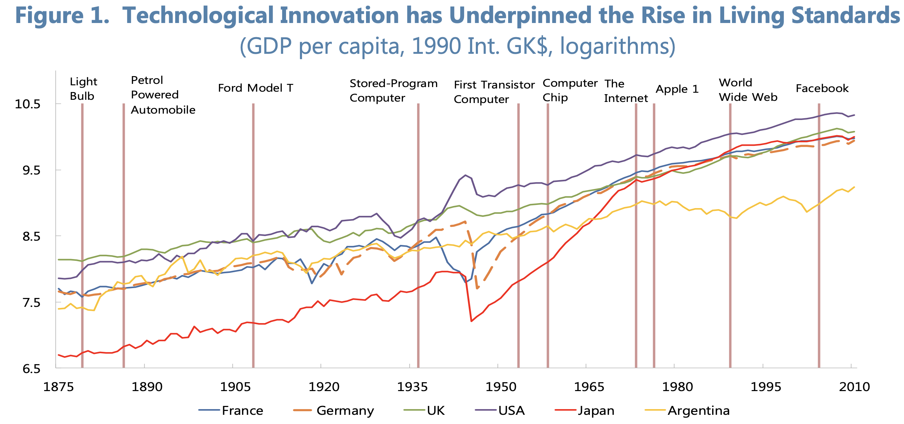
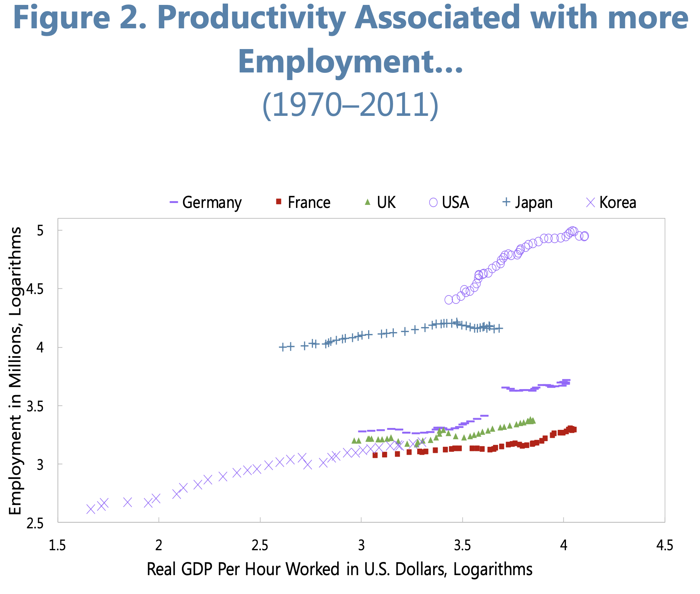
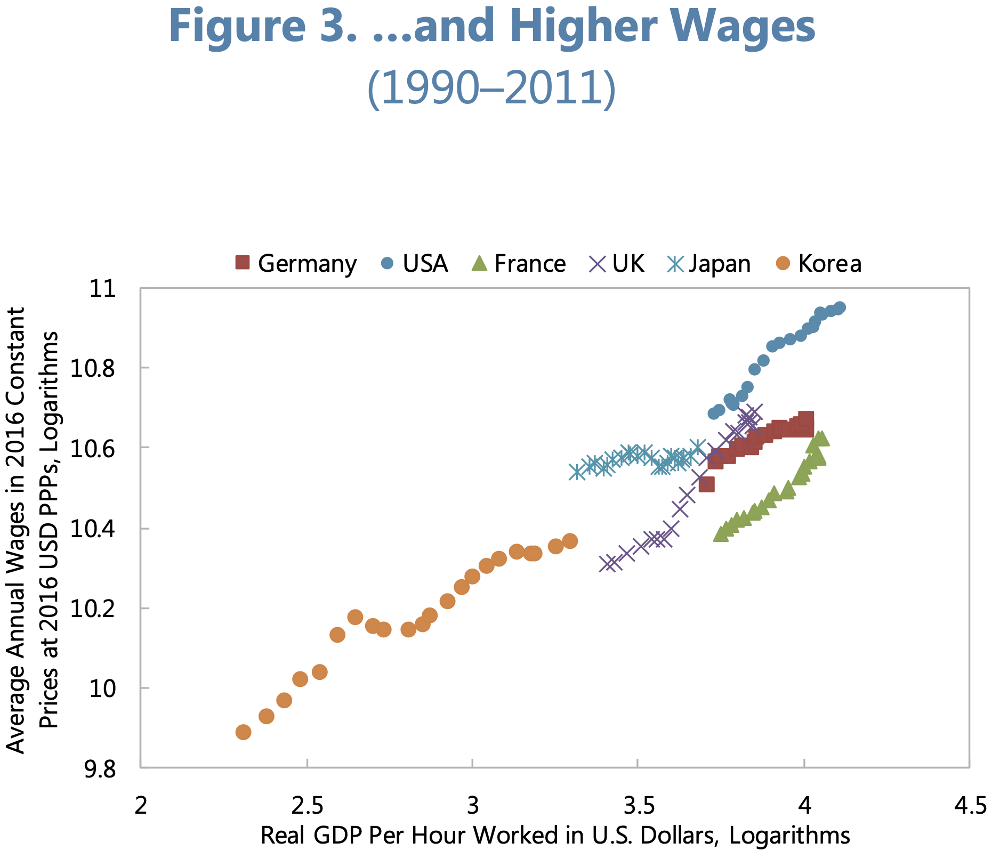
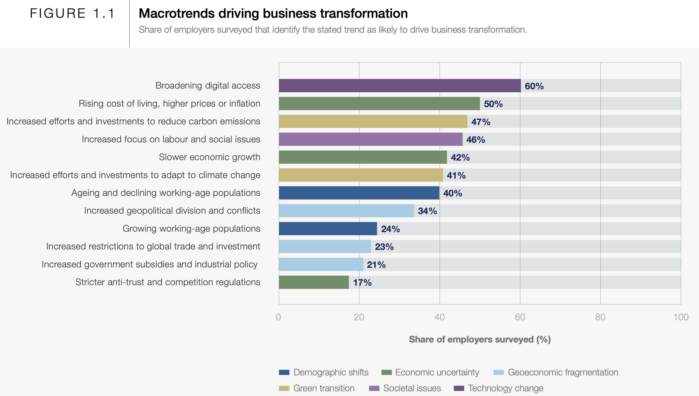
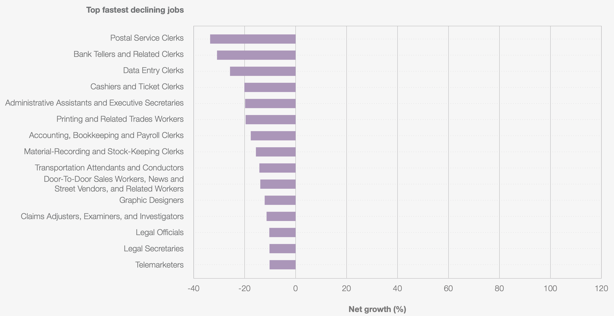
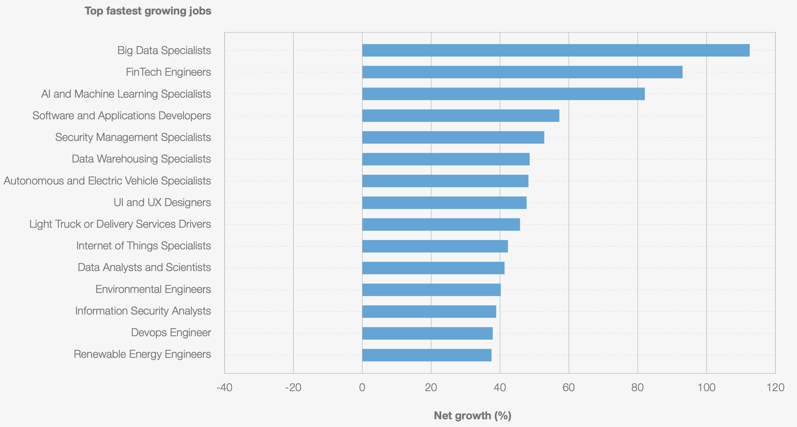
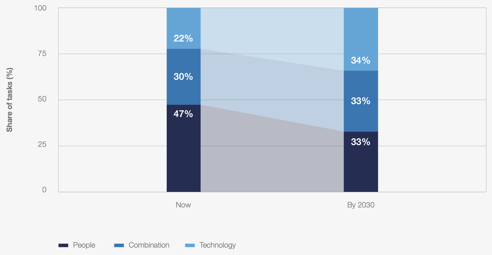
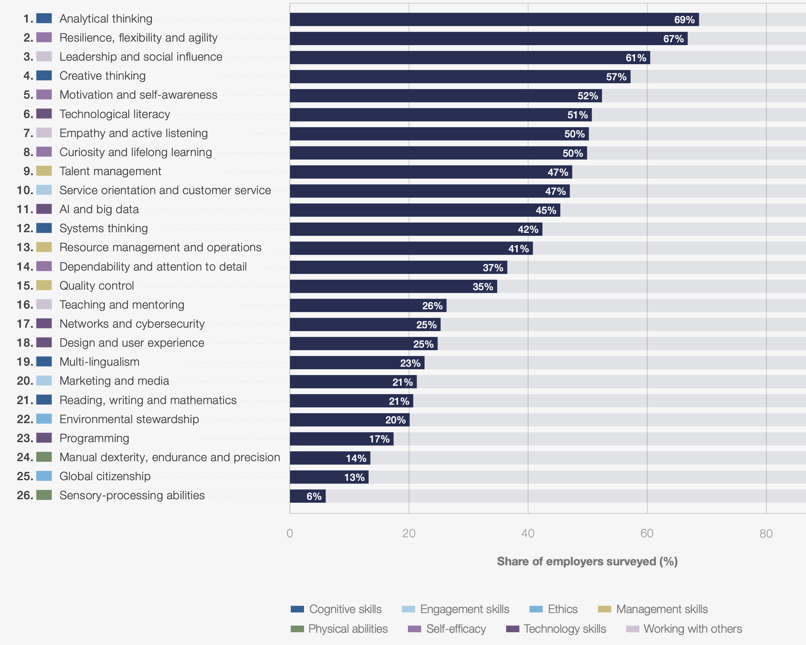

# Revolução tecnológica e impactos no trabalho

## Objetivo da aula

Compreender como a revolução tecnológica vem transformando o trabalho, os perfis profissionais e as competências exigidas nas organizações, relacionando esse cenário ao campo de atuação do secretariado executivo.

## Objetivos específicos

-   entender a transformação tecnológica como processo histórico e organizacional
-   analisar como automação, digitalização, inteligência artificial e novas plataformas alteram atividades e ocupações
-   discutir os impactos da tecnologia sobre produtividade, emprego, desigualdade e exigências de qualificação
-   identificar riscos e oportunidades para profissionais do secretariado executivo
-   refletir sobre competências humanas e digitais que tendem a ganhar valor nos próximos anos

------------------------------------------------------------------------

## Visão geral

A proposta desta aula é construir um caminho lógico que parte de uma ideia simples:

> a tecnologia não afeta apenas máquinas e sistemas; ela reorganiza o trabalho, redefine funções e muda o valor de certas competências.

A aula articula três perspectivas:

1.  transformação organizacional
2.  transformação econômica de longo prazo
3.  tendências do mercado de trabalho

------------------------------------------------------------------------

## Da informatização à transformação do trabalho

### Da burocracia manual à operação digital

Antes da digitalização, muitas atividades organizacionais dependiam de papel, arquivos físicos e comunicação lenta.

Com a digitalização:

-   a informação circula com mais rapidez\
-   processos ficam registrados em sistemas\
-   gestores e funcionários acessam dados diretamente\
-   atividades antes centralizadas passam a ser distribuídas

### O RH como exemplo de transformação

A tecnologia:

-   agiliza recrutamento e seleção\
-   automatiza rotinas administrativas\
-   melhora o acompanhamento de desempenho\
-   amplia acesso à informação

Mas também gera desafios:

-   resistência à mudança\
-   necessidade de qualificação\
-   novas formas de vigilância e controle

### Conexão com o secretariado executivo

O secretariado executivo historicamente atua em funções como:

-   organização da informação\
-   comunicação institucional\
-   apoio à gestão\
-   articulação entre setores

Isso significa que a profissão **está no centro da transformação digital**, e não fora dela.

------------------------------------------------------------------------

## O que a história econômica mostra sobre tecnologia e trabalho

O relatório do FMI ajuda a compreender a relação entre inovação tecnológica, produtividade e emprego, utilizando o GDP (do inglês *Gross Domestic Product*, Produto Interno Bruto (PIB)).

### Tecnologia como motor de crescimento

```{r fig-produtividade-vida, echo=FALSE, fig.cap="Technological Innovation Has Underpinned the Rise in Living Standards. Fonte: FMI – Technology and the Future of Work. A figura apresenta a evolução histórica da renda per capita em diferentes países e mostra como o aumento do padrão de vida está associado a ondas de inovação tecnológica. O gráfico ajuda a demonstrar que, no longo prazo, tecnologia esteve ligada ao crescimento econômico e à melhoria das condições de vida."}

```

Historicamente, inovações como:

-   máquina a vapor
-   eletricidade
-   automóvel
-   computador
-   internet

estiveram associadas ao aumento da produtividade e da renda média.

------------------------------------------------------------------------

### Produtividade e emprego

```{r fig-produtividade-emprego, echo=FALSE, fig.cap="Productivity Associated with More Employment. Fonte: FMI – Technology and the Future of Work. O gráfico compara crescimento de produtividade e níveis de emprego em diferentes economias. A análise mostra que aumentos de produtividade não implicam necessariamente redução do emprego agregado, contrariando a ideia simplista de que automação sempre elimina trabalho."}

```

Mesmo com automação, novas atividades econômicas surgem e novos setores são criados.

------------------------------------------------------------------------

### Produtividade e salários

```{r fig-produtividade-salarios, echo=FALSE, fig.cap="Productivity and Wages. Fonte: FMI – Technology and the Future of Work. A figura mostra a relação histórica entre crescimento da produtividade e aumento dos salários médios. Embora essa relação não seja perfeita, o gráfico sugere que ganhos de produtividade frequentemente estiveram associados a aumentos salariais no longo prazo."}

```

Isso reforça que tecnologia pode gerar crescimento econômico, embora os benefícios nem sempre sejam distribuídos igualmente.

------------------------------------------------------------------------

### Polarização do trabalho

Esse fenômeno significa que:

-   ocupações rotineiras são mais automatizadas
-   ocupações altamente qualificadas capturam mais ganhos

------------------------------------------------------------------------

## O que muda entre 2025 e 2030

O relatório do Fórum Econômico Mundial apresenta tendências concretas para o futuro do trabalho.

### Tendências que transformam as organizações

```{r fig-macrotrends, echo=FALSE, fig.cap="Macrotrends Driving Business Transformation. Fonte: World Economic Forum – Future of Jobs Report 2025. A figura apresenta as principais tendências que devem transformar as organizações até 2030, incluindo expansão digital, inteligência artificial, transição verde e mudanças demográficas."}

```

Essas tendências mostram que mudanças tecnológicas estão inseridas em um contexto mais amplo de transformação econômica e social.

------------------------------------------------------------------------

### Funções em crescimento e em declínio

```{r fig-jobs-growth-decline, echo=FALSE, fig.cap="Fastest-Growing and Fastest-Declining Jobs. Fonte: World Economic Forum – Future of Jobs Report 2025. O gráfico compara ocupações com maior crescimento esperado e aquelas com maior declínio até 2030. Destacam-se funções ligadas a dados, tecnologia e sustentabilidade entre as que crescem, enquanto funções administrativas rotineiras aparecem entre as que tendem a diminuir."}

```

```{r fig-jobs-growth, echo=FALSE, fig.cap="Fastest-Growing and Fastest-Declining Jobs. Fonte: World Economic Forum – Future of Jobs Report 2025. O gráfico compara ocupações com maior crescimento esperado e aquelas com maior declínio até 2030. Destacam-se funções ligadas a dados, tecnologia e sustentabilidade entre as que crescem, enquanto funções administrativas rotineiras aparecem entre as que tendem a diminuir."}

```

O relatório indica crescimento de funções como:

-   especialistas em IA
-   analistas de dados
-   especialistas em segurança digital

E declínio de funções altamente rotineiras.

------------------------------------------------------------------------

### Fronteira entre trabalho humano e tecnologia

```{r fig-human-machine, echo=FALSE, fig.cap="The Shifting Human-Machine Frontier. Fonte: World Economic Forum – Future of Jobs Report 2025. A figura mostra a proporção de tarefas realizadas por humanos, por máquinas e por colaboração entre ambos. O gráfico indica que o futuro do trabalho envolve não apenas substituição, mas também cooperação entre pessoas e sistemas tecnológicos."}

```

Isso reforça que **automação não significa necessariamente substituição completa**, mas frequentemente reorganização das tarefas.

------------------------------------------------------------------------

## Competências do futuro

### Competências centrais

```{r fig-skills, echo=FALSE, fig.cap="Core Skills in 2025. Fonte: World Economic Forum – Future of Jobs Report 2025. O gráfico identifica as competências consideradas mais importantes pelos empregadores, incluindo pensamento analítico, criatividade, liderança, resiliência e letramento tecnológico."}

```

Entre as competências em crescimento estão:

-   pensamento analítico
-   criatividade
-   letramento tecnológico
-   aprendizagem contínua

------------------------------------------------------------------------

## Aplicação ao Secretariado Executivo

### Riscos

-   automação de tarefas administrativas
-   uso crescente de assistentes virtuais
-   redução de atividades puramente operacionais

### Oportunidades

-   gestão qualificada da informação
-   coordenação de fluxos de trabalho digitais
-   apoio executivo em ambiente tecnológico
-   mediação comunicacional entre setores

### Reposicionamento profissional

O diferencial passa a estar em:

-   interpretar informações
-   organizar processos
-   comunicar com qualidade
-   apoiar decisões estratégicas

------------------------------------------------------------------------

## Atividade em sala

1.  Quais atividades do secretariado executivo tendem a ser mais automatizadas?

2.  Quais competências humanas devem ganhar mais valor?

3.  Como usar inteligência artificial de forma estratégica na profissão?

4.  Os dados apresentados podem apoiar seu TCC? Selecione esses dados utilizando os artigos disponibilizados no Classroom da disciplina.

Envie a resposta desta atividade no Classroom.

------------------------------------------------------------------------

## Conclusão

A revolução tecnológica não elimina a necessidade de profissionais qualificados.

Ela **reorganiza o valor do trabalho**, reduzindo tarefas rotineiras e ampliando o valor de atividades baseadas em:

-   interpretação
-   comunicação
-   coordenação
-   tomada de decisão
-   aprendizagem contínua

Para o secretariado executivo, o desafio não é competir com a tecnologia, mas **utilizá-la para ampliar a inteligência organizacional e a capacidade de coordenação nas organizações**.

------------------------------------------------------------------------

## Referências

-   INTERNATIONAL MONETARY FUND. *Technology and the Future of Work*.
-   WORLD ECONOMIC FORUM. *Future of Jobs Report 2025*.
-   MARCHI, J.; BERTAGNOLLI, D.; SEVERO, C.; SILVA, P. *O impacto das tecnologias digitais nos processos de gestão de pessoas*.
