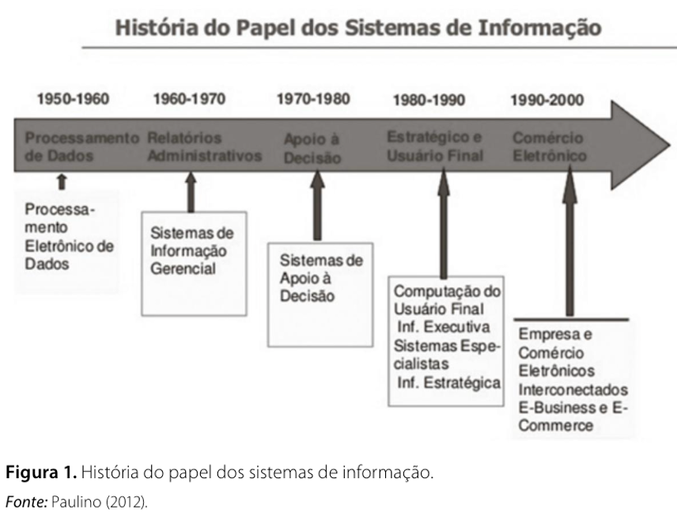
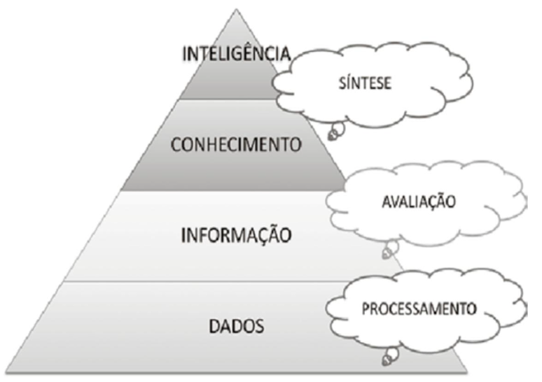
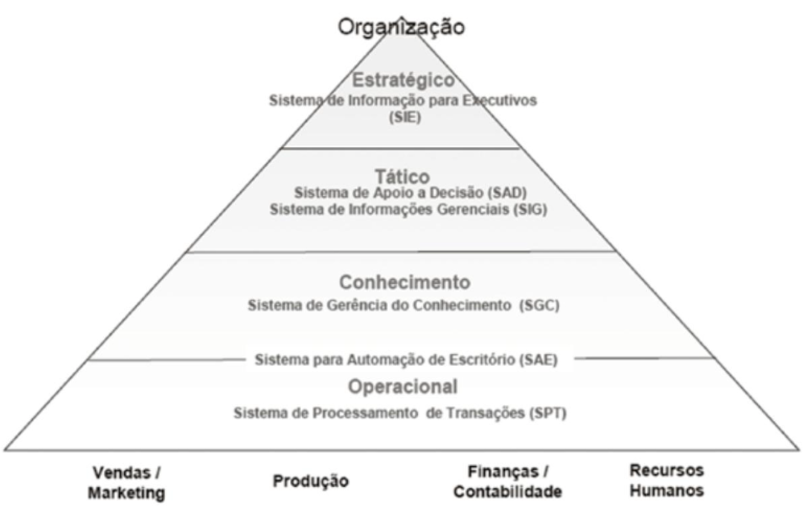
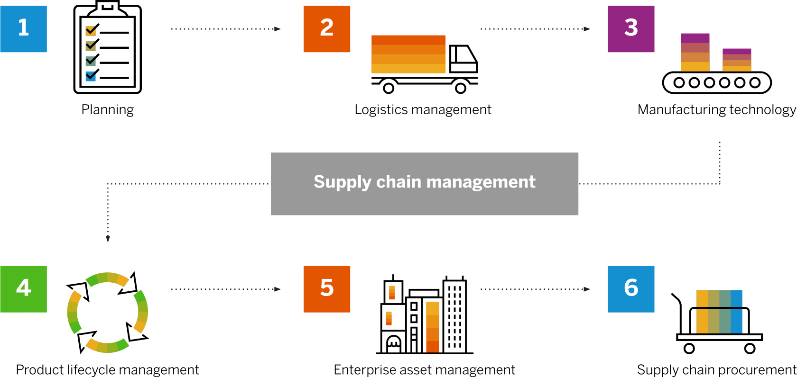

# Tipos de Sistemas de Informação

## Introdução

Os sistemas de informação estão presentes em praticamente todas as organizações modernas e são fundamentais para apoiar operações, decisões e estratégias. Diferentes níveis organizacionais demandam diferentes tipos de sistemas, o que leva à necessidade de classificação.

Segundo Kroenke (2012), um sistema de informação é composto por hardware, software, dados, procedimentos e pessoas, organizados para produzir informações úteis. Já Gonçalves (2017) destaca que esses sistemas são essenciais para transformar dados em informação e apoiar a gestão empresarial.

> 💡 **Conceito-chave**\
> Sistema de informação = conjunto organizado de recursos que coleta, processa, armazena e distribui informação para suporte à tomada de decisão.

------------------------------------------------------------------------

## Sistemas e contexto organizacional

Um sistema pode ser entendido como um conjunto de componentes inter-relacionados que trabalham juntos para atingir um objetivo comum.

No contexto organizacional:

-   Empresas são sistemas complexos;
-   Setores são subsistemas;
-   Sistemas de informação integram essas partes.

> 🧠 **Exemplo aplicado**\
> Em um e-commerce:\
> Entrada → pedido do cliente\
> Processamento → validação e pagamento\
> Saída → entrega + atualização no sistema

> ⚠️ **Atenção**\
> Um sistema de informação não é apenas software — envolve também pessoas e processos.

------------------------------------------------------------------------

## Por que as empresas utilizam sistemas de informação?

-   Organizações possuem múltiplos níveis hierárquicos;
-   Cada nível exige diferentes informações;
-   Decisões dependem de dados confiáveis.

```{r fig-history, echo=FALSE, fig.cap="Linha do tempo apresentando os marcos da evolução de sistemas de informação.", out.width="80%"}

```

> 💡 **Conceito-chave**\
> Informação de qualidade reduz incerteza — ou seja, diminui a **entropia organizacional**.

> 📊 **Na prática**\
> Empresas utilizam sistemas para: - Automatizar tarefas; - Monitorar desempenho; - Planejar o futuro.

------------------------------------------------------------------------

## Dados vs. Informação

Para compreender os conceitos envolvidos em Sistemas de informação é importante compreender a diferença de *Dados*, *Informação* e *Conhecimento*.

```{r fig-dados, echo=FALSE, fig.cap="Pirâmide representando os niveis de abstração que separam Dados, informação e conhecimento.", out.width="80%"}

```

**Dados:** Segundo uma das definições da palavra aplicada ao contexto, dados são um conjunto de valores ou ocorrências em um estado bruto, ou seja, podem ser inúmeros e não relacionados entre si, portanto precisam de tratamento para que virem ou uma informação e, então, descrevam as características de um evento aleatório.

**Informações:** Pode ser definida como um conjunto de dados organizados, que nos trazem uma mensagem sobre um evento ou fenômeno. Ela vai ser a base do conhecimento, pois acaba por trazer as possibilidades Informação: pode ser definida como um conjunto de dados organizados, que nos trazem uma mensagem sobre um evento ou fenômeno. Ela vai ser a base do conhecimento, pois acaba por trazer as possibilidades.

**Conhecimento:** No sentido mais lato do termo, trata-se da posse de múltiplos dados inter-relacionados que, por si só, têm um menor valor qualitativo. O conhecimento não é ad-quirido, por exemplo, encostando a cabeça em um livro e “pegando” as informações contidas nesse livro, há que se ter interação pela leitura, ou seja, uma pesquisa feita nesse livro e depois algum tipo de interação proveniente dessa pesquisa, com a combinação desses três elementos o indivíduo estará adquirindo conhecimento.

> Características da bia informação
>
> Nem todas as informações são iguais. Algumas informações são melhores que outras. A boa infromação reune as seguintes características:
>
> -   Precisa
>
> -   Oportuna
>
> -   Relevante: para o contexto e para o assunto
>
> -   Apenas o suficiente - Vale o seu custo

------------------------------------------------------------------------

## Classificação dos sistemas de informação

Os sistemas são classificados conforme os níveis organizacionais:

-   Estratégico\
-   Tático\
-   Operacional

```{r fig-organizacao-SI, echo=FALSE, fig.cap="Pirâmide representando os niveis organizacionais de uma empresa, associação a tipos de sistemas de informação utilizados em cada nível.", out.width="80%"}

```

> 🧩 **Reflexão guiada**\
> Pense em uma empresa real:\
> - Quem toma decisões estratégicas?\
> - Quem executa atividades operacionais?\
> - Que tipo de informação cada grupo precisa?

------------------------------------------------------------------------

## Sistemas de Processamento de Transações (SPT)

Atuam no nível operacional.

### Características

-   Processamento de grande volume de dados;
-   Operações rotineiras;
-   Alta frequência de uso.

> 💡 **Conceito-chave**\
> SPT = base de todos os outros sistemas.

### Exemplos

-   Caixa de supermercado;
-   Sistemas bancários;
-   Controle de estoque.

> 🧠 **Exemplo aplicado**\
> Ao passar um produto no caixa: - Venda é registrada; - Estoque é atualizado; - Nota é gerada automaticamente.

> ⚠️ **Atenção**\
> Se o SPT falhar, todos os níveis superiores serão impactados.

------------------------------------------------------------------------

## Sistemas de Informações Gerenciais (SIG)

Atuam no nível tático.

### Características

-   Geram relatórios;
-   Consolidam dados;
-   Apoiam controle gerencial.

> 💡 **Conceito-chave**\
> SIG transforma dados operacionais em informação útil para gestão.

> 🧠 **Exemplo aplicado**\
> Um gerente analisa: - Relatório mensal de vendas; - Comparação entre filiais; - Indicadores de desempenho.

> 📊 **Pergunta típica**\
> “As metas estão sendo atingidas?” :contentReference[oaicite:4]{index="4"}

------------------------------------------------------------------------

## Sistemas de Apoio à Decisão (SAD)

Focados em decisões mais complexas.

### Características

-   Simulações;
-   Análise de cenários;
-   Apoio a decisões não rotineiras.

> 💡 **Conceito-chave**\
> SAD = ferramenta para explorar possibilidades.

> 🧠 **Exemplo aplicado**\
> Uma empresa avalia: - “E se aumentarmos a produção?” - “Qual o impacto de reduzir custos?”

> ⚠️ **Atenção**\
> SAD não substitui o gestor — ele **apoia**, não decide.

------------------------------------------------------------------------

## Sistemas de Apoio ao Executivo (SAE)

Atuam no nível estratégico.

### Características

-   Informações resumidas;
-   Foco no longo prazo;
-   Uso de dados internos e externos.

> 💡 **Conceito-chave**\
> SAE = visão global do negócio.

> 🧠 **Exemplo aplicado**\
> Um diretor analisa: - Tendências de mercado; - Indicadores econômicos; - Estratégias de crescimento.

> 📊 **Pergunta típica**\
> “Onde a empresa deve estar nos próximos anos?” :contentReference[oaicite:5]{index="5"}

------------------------------------------------------------------------

## Aplicativos Integrados

Os sistemas modernos são integrados :contentReference[oaicite:6]{index="6"}.

### Tipos principais

-   ERP (Sistemas integrados de gestão, do inglês _Enterprise Resource Planning_) → integra processos internos\
-   CRM → (Sistema de gerenciamento de clientes, do inglês _Costumer Relationship Management_) gestão de clientes\
-   SCM → (Gerenciamento da cadeia de suprimentos, do inglês _Supply Chain Management_) cadeia de suprimentos\
-   SGC → ( ) gestão do conhecimento

> 💡 **Conceito-chave**\
> Integração = dados fluindo entre setores sem redundância.


```{r fig-scm, echo=FALSE, fig.cap="Esquema com principais componentes da gestão da cadeia de suprimentos. Fonte: sap.com, 2026.", out.width="80%"}

```

> 🧠 **Exemplo aplicado**\
> Um pedido no sistema: - Atualiza estoque (ERP); - Registra cliente (CRM); - Aciona logística (SCM).

> ⚠️ **Atenção**\
> Sistemas não integrados geram retrabalho e inconsistência.

------------------------------------------------------------------------

## Relação entre os sistemas

Os sistemas formam uma estrutura hierárquica:

-   SPT → base de dados\
-   SIG → relatórios\
-   SAD → análise\
-   SAE → estratégia

> 📊 **Interpretação importante**\
> Quanto mais alto o nível: - Menos detalhamento; - Mais abstração; - Maior impacto nas decisões.

------------------------------------------------------------------------

## Sistemas de informação e vantagem competitiva

Segundo Gonçalves (2017):

-   Sistemas reduzem incerteza;
-   Melhoram eficiência;
-   Apoiam inovação.

Kroenke (2012) complementa:

-   Informação correta → melhor decisão\
-   Melhor decisão → vantagem competitiva

> 💡 **Conceito-chave**\
> Informação = ativo estratégico.

> 🧩 **Reflexão guiada**\
> Pense em empresas como Amazon ou Netflix:\
> - Como usam dados?\
> - Que tipo de sistema utilizam?

------------------------------------------------------------------------

## Atividade proposta

Em dupla:

-   Escolha uma empresa real;
-   Identifique:
    -   SPT
    -   SIG
    -   SAD
    -   SAE
-   Descreva como esses sistemas se relacionam;
-   Apresente exemplos reais.

> 📊 **Dica**\
> Empresas digitais (bancos, e-commerce, apps) facilitam essa análise.

## Atividade 2

**GUIA ÉTICO**: *Egocentrismo versus compreensão*

De acordo com uma das definições do termo, um “problema” é uma diferença percebida entre o que é e o que deveria ser. Em se tratando de desenvolvimento de sistemas de informação, é fundamental que a equipe de desenvolvimento tenha uma definição e um enten- dimento comum do problema. Esse entendimento co- mum, no entanto, pode ser difícil de alcançar.

Os cientistas cognitivos distinguem egocentrismo de compreensão. O pensamento egocêntrico está centrado na própria pessoa. Uma pessoa envolvida em um pensamento egocêntrico considera o seu ponto de vista como “o ponto de vista real” ou “o que realmente é”. Por outro lado, aqueles envolvidos em um pensamento empático consideram o seu ponto de vista como uma das possíveis interpretações da situação e se esforçam para saber o que os outros pensam.

Diferentes especialistas recomendam o pensamento empático por diferentes razões. Os líderes religiosos dizem que esse tipo de pensamento é moralmente superior; os psicólogos dizem que o pensamento baseado na compreensão leva a relacionamentos mais ricos e gratificantes. No mundo dos negócios, esse tipo de pensamento é recomendável por ser considerado uma tática inteligente. Um negócio é um esforço social, e aqueles capazes de compreender os pontos de vida dos outros sempre são mais eficazes. Mesmo que não concorde com as opiniões alheias, compreendendo seus pontos de vista, você terá muito mais condições de trabalhar com eles.

Vejamos o seguinte exemplo. Suponhamos que você diga ao seu professor de SIG:

– Professor Jones, eu não pude vir à aula na segun- da-feira passada. Fizemos algo de importante?

Essa explicação é um belo exemplo de pensamento egocêntrico. Não leva em consideração o ponto de vista do seu professor e subentende que ele não falou nada importante. Como professor, dá vontade de dizer:

– Não, ao notar que você não estava aí, eu exclui todo o conteúdo importante da aula.

Para se engajar em um pensamento empático, considere essa situação pela perspectiva do professor. Os alunos que faltam às aulas geram trabalho extra para seus professores. Não importa a razão para não ter ido à aula; na verdade, você pode até ter tido uma febre de 40 ̊C. Mas independentemente do motivo, a sua ausência implica mais trabalho para o seu professor. Ele precisa ministrar alguma atividade extra para ajudá-lo a recuperar a aula perdida.

Se fosse compreensivo, você faria o possível para minimizar o impacto da sua ausência. Por exemplo, poderia dizer:

– Eu não pude vir à aula, mas peguei a matéria com a Mary. Eu dei uma lida nas anotações da aula e tenho uma dúvida em relação aos processos de negócios e à maneira como eles estão relacionados à informacão. Ah, a propósito, desculpe perturbá-lo com o meu problema . Antes de prosseguirmos, vejamos a conclusão dessa situação: Nunca, jamais, envie um e-mail ao seu chefe dizendo:

– Não pude comparecer à reunião de funcionários na quarta-feira. Foi feito algo de importante?

Evite essa atitude pelas mesmas razões pelas quais não deve fazer isso quando tiver faltado à aula. Em vez disso, procure uma maneira de minimizar o impacto da sua ausência no seu chefe.

Agora, o que isso tem a ver com SIG? Suponhamos que você compre um novo laptop e, depois de alguns dias, o aparelho apresente defeito. Repetidas ligações para o serviço de atendimento ao cliente geram paliativos de curto prazo, mas ninguém se lembra de quem você é ou do que lhe foi sugerido no passado. Imagine que o teclado continue a travar depois de alguns dias. Nesse caso, existem algumas hipóteses para o problema:

1.  o representante do serviço de atendimento ao cliente não possui quaisquer dados sobre contatos anteriores efetuados pelo cliente;

2.  o representante do serviço de atendimento ao cliente recomendou uma solução que não deu certo;

3.  a empresa está embarcando muitos laptops com defeito. A solução para cada uma dessas definições de problema requer um sistema de informação diferente.

Agora imagine uma reunião para tratar dessa situação em que os diferentes participantes da reunião defendam três pontos de vista sobre o problema. O que acontecerá se todos pensarem de forma egocêntrica?

A reunião será argumentativa e provavelmente terminará sem que nada seja resolvido.Imaginemos, por outro lado, que os participantes sejam compreensivos. Nesse caso, as pessoas farão um esforço coletivo no sentido de compreender os diferentes pontos de vista e o resultado será muito mais positivo – possivelmente uma definição dos três problemas classificados por ordem de prioridade. Em ambas as situações, os participantes possuem as mesmas informações; a diferença de resultados é uma consequência do modo de pensar das pessoas.A compreensão é uma habilidade importante em toda atividade de negócios. Os negociadores hábeis sempre sabem o que o outro lado quer, da mesma forma que os vendedores eficazes compreendem as necessidades de seus clientes. Os compradores que compreendem os problemas de seus fornecedores recebem um melhor serviço. E os alunos que compreendem a perspectiva de seus professores têm melhor desempenho.

### Questões para discussão

1.  Com suas próprias palavras, explique a diferença entre egocentrismo e compreensão.

2.  Suponhamos que você e outra pessoa divergem substancialmente em relação à definição de um problema. Suponhamos que ela lhe diga: “Não, o proble- ma, na verdade, é que...”, seguido pela definição que ela tem para o problema. O que você responde?

3.  Novamente, imagine que você e outra pessoa divergem substancialmente em relação à definição de um problema. Vamos supor que você entenda a definição dela. Como você esclareceria melhor esse fato?

4.  Explique a afirmação: “Em negócio, o pensamento baseado na empatia é uma tática inteligente”. Você concorda?

------------------------------------------------------------------------

## Referências

GONÇALVES, Glauber Rogério Barbieri. Sistemas de Informação. Porto Alegre: SAGAH, 2017.

KROENKE, David M. Sistemas de Informação Gerenciais. Rio de Janeiro: Saraiva, 2012.
