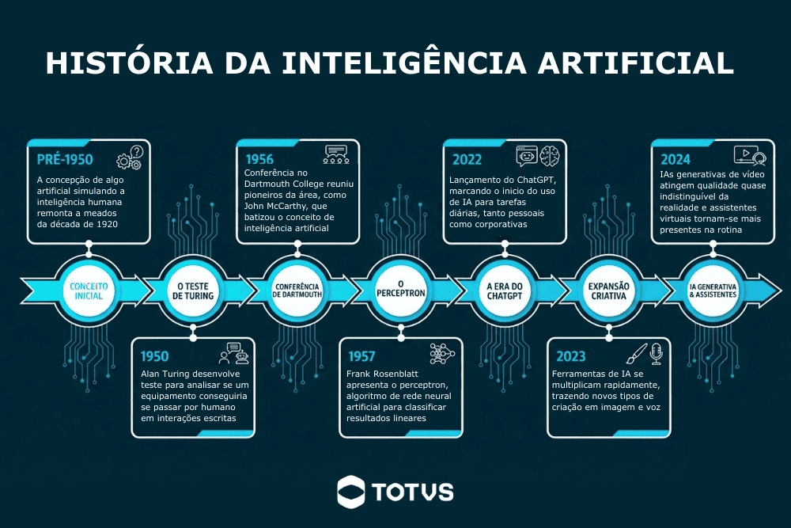

# IA

## Inteligência Artificial: conceitos fundamentais e aplicações organizacionais

A Inteligência Artificial (IA) tornou-se um dos temas centrais da transformação digital contemporânea. O crescimento da capacidade computacional, a disponibilidade massiva de dados e os avanços em algoritmos de aprendizado de máquina permitiram o desenvolvimento de sistemas capazes de executar tarefas anteriormente restritas à cognição humana, como interpretação de linguagem, reconhecimento de padrões, geração de conteúdo e apoio à tomada de decisão.

Atualmente, organizações públicas e privadas utilizam soluções baseadas em IA para automatizar processos, apoiar análises estratégicas, melhorar a comunicação institucional e aumentar a eficiência operacional. Nesse contexto, compreender os fundamentos da Inteligência Artificial deixou de ser um conhecimento exclusivamente técnico e passou a integrar as competências necessárias para profissionais de gestão, administração e secretariado executivo.

Este capítulo apresenta os principais conceitos relacionados à Inteligência Artificial, sua evolução histórica, classificações, aplicações organizacionais e os impactos produzidos pela adoção dessas tecnologias no ambiente corporativo.

## O que é Inteligência Artificial?

A Inteligência Artificial pode ser definida como uma área da ciência da computação dedicada ao desenvolvimento de sistemas capazes de realizar tarefas que normalmente exigiriam inteligência humana, como aprendizado, raciocínio, percepção, resolução de problemas e tomada de decisão [@russell2021].

De acordo com Russell e Norvig [@russell2021], a IA pode ser compreendida como o estudo de agentes inteligentes, isto é, sistemas capazes de perceber o ambiente em que estão inseridos e agir de maneira racional para alcançar determinados objetivos.

Outra definição amplamente utilizada é apresentada por Kaplan e Haenlein [@kaplan2019], que descrevem a Inteligência Artificial como:

> “A capacidade de um sistema interpretar corretamente dados externos, aprender com esses dados e utilizar esse aprendizado para atingir objetivos específicos de maneira flexível.”

```{r fig-history_ia, echo=FALSE, fig.cap="Linha do tempo com principais marcos na história da inteligência artificial."}

```

Embora muitas vezes associada apenas a robôs ou sistemas futuristas, a IA já está presente em diversas atividades cotidianas, muitas vezes de maneira imperceptível ao usuário.

## Inteligência Artificial no cotidiano

Diversos sistemas digitais amplamente utilizados incorporam técnicas de Inteligência Artificial em seus processos internos. Plataformas de streaming utilizam algoritmos para recomendar conteúdos com base no comportamento do usuário; mecanismos de busca classificam resultados considerando padrões de relevância; assistentes virtuais interpretam linguagem natural; sistemas bancários detectam fraudes por meio da identificação de padrões anômalos em transações financeiras.

Alguns exemplos comuns incluem:

- recomendação de filmes e séries em plataformas de streaming;
- sugestões automáticas de texto em serviços de e-mail;
- reconhecimento facial em smartphones;
- tradutores automáticos;
- filtros de spam;
- assistentes virtuais;
- sistemas de navegação por GPS;
- algoritmos de recomendação em redes sociais.

Esses exemplos demonstram que a IA está diretamente associada à análise de grandes volumes de dados e à capacidade de identificar padrões relevantes para auxiliar processos decisórios.

## Atividade prática: identificando IA em sistemas digitais

::: {.exercise}
### Atividade

Em grupos, identifique aplicações de Inteligência Artificial presentes em ferramentas digitais utilizadas no cotidiano.

Para cada sistema identificado, descreva:

1. Qual aplicação foi analisada;
2. Qual funcionalidade utiliza IA;
3. Qual problema essa tecnologia procura resolver;
4. Quais benefícios e riscos podem estar associados ao uso dessa solução.
:::

## Inteligência Artificial e automação

Um dos equívocos mais frequentes relacionados à IA é considerá-la sinônimo de automação. Embora estejam relacionadas, automação e Inteligência Artificial representam conceitos distintos.

A automação tradicional baseia-se em regras previamente programadas. O sistema executa instruções definidas explicitamente por desenvolvedores, sem capacidade de adaptação ou aprendizado.

Um exemplo simples é um sistema de autenticação:

```text
SE usuário = válido
ENTÃO permitir acesso
SENÃO negar acesso
```

Nesse caso, todas as possibilidades precisam ser previamente previstas.

A Inteligência Artificial, por outro lado, utiliza modelos capazes de aprender padrões a partir de dados. Em vez de apenas seguir regras fixas, sistemas inteligentes conseguem identificar relações, gerar previsões e adaptar comportamentos.

Por exemplo, filtros de spam em serviços de e-mail não dependem exclusivamente de listas estáticas de palavras proibidas. Esses sistemas analisam padrões em milhões de mensagens para identificar características associadas a conteúdos indesejados.

Segundo Davenport e Ronanki [@davenport2018], a principal diferença entre automação convencional e IA está na capacidade de aprendizado e adaptação dos sistemas inteligentes.

## Aprendizado de Máquina (Machine Learning)

Grande parte das aplicações modernas de IA utiliza técnicas de Aprendizado de Máquina (*Machine Learning*). Nesse paradigma, os sistemas aprendem automaticamente a partir de exemplos e dados históricos.

Em vez de programar explicitamente todas as regras, os desenvolvedores fornecem grandes volumes de dados para treinamento dos modelos.

Mitchell [@mitchell1997] define aprendizado de máquina como:

> “A capacidade de um programa computacional melhorar seu desempenho em determinada tarefa por meio da experiência.”

Os algoritmos de *Machine Learning* podem ser utilizados para:

- classificação;
- previsão;
- reconhecimento de padrões;
- recomendação;
- detecção de anomalias;
- agrupamento de informações.

## Tipos de aprendizado de máquina

Os principais paradigmas de aprendizado de máquina incluem:


*Aprendizado supervisionado*

Nesse modelo, o algoritmo é treinado utilizando exemplos rotulados previamente.

Exemplo:
- identificar mensagens como “spam” ou “não spam”;
- prever aprovação ou reprovação de crédito.

*Aprendizado não supervisionado*

O sistema procura padrões nos dados sem categorias previamente definidas.

Exemplo:
- agrupamento de clientes por perfil de consumo;
- identificação de comportamentos semelhantes.

*Aprendizado por reforço*

O sistema aprende por tentativa e erro, recebendo recompensas ou penalidades.

Esse modelo é frequentemente utilizado em:
- robótica;
- jogos;
- veículos autônomos.

*Deep Learning e redes neurais artificiais*

O avanço recente da IA está fortemente associado ao desenvolvimento do *Deep Learning*, uma subárea baseada em redes neurais artificiais profundas.

As redes neurais artificiais são inspiradas, de maneira simplificada, no funcionamento do cérebro humano, sendo compostas por unidades interconectadas chamadas neurônios artificiais.

Segundo Goodfellow, Bengio e Courville [@goodfellow2016], o *Deep Learning* permitiu avanços significativos em áreas como:

- reconhecimento de voz;
- visão computacional;
- processamento de linguagem natural;
- geração automática de conteúdo.

Esses avanços possibilitaram o surgimento de ferramentas capazes de produzir textos, imagens e vídeos com elevado grau de sofisticação.

*IA generativa*

A IA generativa representa uma das áreas mais recentes e populares da Inteligência Artificial. Diferentemente de sistemas voltados apenas à análise de dados, modelos generativos conseguem criar novos conteúdos.

Esses sistemas podem gerar:

- textos;
- imagens;
- vídeos;
- áudios;
- apresentações;
- códigos de programação.

Ferramentas como:

- [ChatGPT](https://chatgpt.com?utm_source=chatgpt.com)
- [Gemini](https://gemini.google.com?utm_source=chatgpt.com)
- [Microsoft Copilot](https://copilot.microsoft.com?utm_source=chatgpt.com)

popularizaram o uso da IA generativa em ambientes acadêmicos e corporativos.

Segundo Dwivedi et al. [@dwivedi2023], modelos generativos possuem potencial para transformar atividades relacionadas à comunicação, produção textual, atendimento, análise de dados e automação organizacional.

## Aplicações organizacionais da Inteligência Artificial

A adoção de soluções baseadas em IA vem crescendo rapidamente nas organizações. Sistemas inteligentes podem auxiliar tanto atividades operacionais quanto processos estratégicos.

### Comunicação organizacional{-}

A IA pode ser utilizada para:
- geração automática de e-mails;
- tradução de documentos;
- revisão textual;
- resumo de reuniões;
- elaboração de relatórios.

### Gestão administrativa{-}

Soluções inteligentes auxiliam:
- análise de indicadores;
- previsão de demanda;
- organização documental;
- automação de processos;
- apoio à tomada de decisão.

### Atendimento e suporte{-}

Chatbots e assistentes virtuais permitem:
- atendimento automatizado;
- respostas rápidas;
- redução de filas;
- suporte contínuo.

## Secretariado executivo

No contexto do secretariado executivo, a IA pode apoiar:
- organização de agendas;
- gerenciamento de reuniões;
- elaboração de atas;
- controle de documentos;
- comunicação institucional;
- automação de tarefas repetitivas.

## IA, dados e computação em nuvem

O crescimento da Inteligência Artificial está diretamente relacionado à computação em nuvem. Grande parte dos sistemas modernos de IA depende de infraestrutura distribuída para armazenamento e processamento de grandes volumes de dados.

Segundo Armbrust et al. [@armbrust2010], a computação em nuvem permite acesso escalável a recursos computacionais sob demanda, favorecendo aplicações de alto desempenho.

Atualmente, muitos sistemas de IA operam integralmente em ambientes de nuvem, permitindo:
- acesso remoto;
- colaboração em tempo real;
- processamento distribuído;
- integração entre plataformas.

## Limitações e desafios da Inteligência Artificial

Apesar dos avanços recentes, a IA apresenta limitações importantes.


 - Alucinações (*Hallucinations*): Modelos generativos podem produzir informações incorretas ou inexistentes. ([Leia mais AQUI](https://www.ibm.com/br-pt/think/topics/ai-hallucinations))
 - Viés algorítmico: Sistemas treinados com dados enviesados podem reproduzir desigualdades sociais ou preconceitos. ([Leia mais AQUI: ](https://youtu.be/-sCVfo3AMWE?si=Yiuqdoq4-1LfmYh1));
 - Privacidade: O uso inadequado de dados pode comprometer informações pessoais e institucionais.

## Dependência tecnológica

O uso excessivo de sistemas inteligentes pode reduzir a autonomia analítica dos usuários.


Segundo Floridi e Cowls [@floridi2019], o desenvolvimento responsável da Inteligência Artificial exige princípios éticos relacionados à transparência, justiça, privacidade e responsabilidade social.

## Impactos no mercado de trabalho

A Inteligência Artificial vem modificando significativamente o mercado de trabalho contemporâneo. Algumas atividades tendem à automação, enquanto novas competências passam a ser exigidas dos profissionais.

Entre as habilidades valorizadas atualmente destacam-se:
- pensamento crítico;
- análise de dados;
- comunicação;
- criatividade;
- capacidade de adaptação;
- uso estratégico de tecnologias digitais.

O relatório do World Economic Forum [@wef2025] sobre o futuro do trabalho destaca que a IA deve transformar profundamente atividades administrativas e organizacionais nas próximas décadas.

## Aplicações organizacionais da Inteligência Artificial

A crescente adoção da Inteligência Artificial (IA) pelas organizações vem modificando significativamente a maneira como empresas, instituições públicas e profissionais executam tarefas administrativas, operacionais e estratégicas. O avanço da IA não está restrito apenas à automação industrial ou ao desenvolvimento de sistemas computacionais complexos; atualmente, soluções inteligentes estão integradas a plataformas de comunicação, ferramentas de produtividade, sistemas de gestão empresarial e aplicações utilizadas diariamente em ambientes organizacionais.

Segundo Davenport e Ronanki [@davenport2018], as organizações têm utilizado IA principalmente em três grandes áreas:
- automação de processos;
- análise cognitiva de dados;
- interação inteligente com usuários.

Nesse contexto, compreender como a IA pode ser aplicada às rotinas organizacionais tornou-se uma competência importante para profissionais de gestão, administração e secretariado executivo.

## Transformação digital e Inteligência Artificial

A expansão da IA está diretamente relacionada ao processo de transformação digital das organizações. A transformação digital envolve a incorporação de tecnologias digitais nos processos institucionais, alterando modelos de trabalho, comunicação e tomada de decisão.

De acordo com Verhoef et al. [@verhoef2021], a transformação digital não consiste apenas na adoção de novas ferramentas tecnológicas, mas também na reorganização estrutural dos processos organizacionais e das relações entre pessoas, dados e sistemas.

Nesse cenário, a Inteligência Artificial assume papel estratégico ao permitir:
- automação de atividades repetitivas;
- análise rápida de grandes volumes de dados;
- apoio à tomada de decisão;
- personalização de serviços;
- melhoria da comunicação organizacional.

## Inteligência Artificial e produtividade organizacional

Uma das principais justificativas para adoção de IA nas organizações está associada ao aumento de produtividade. Sistemas inteligentes conseguem reduzir o tempo gasto em atividades operacionais e permitir que profissionais concentrem esforços em tarefas analíticas e estratégicas.

Segundo Brynjolfsson e McAfee [@brynjolfsson2014], tecnologias inteligentes possuem potencial para ampliar significativamente a eficiência organizacional ao automatizar atividades rotineiras e apoiar processos decisórios.

Entre os benefícios organizacionais frequentemente associados à IA destacam-se:
- redução de retrabalho;
- diminuição de erros operacionais;
- maior velocidade no processamento de informações;
- melhoria na organização de dados;
- otimização da comunicação;
- apoio à gestão do conhecimento.

## IA aplicada à comunicação organizacional

A comunicação organizacional é uma das áreas mais impactadas pela IA generativa. Ferramentas inteligentes podem auxiliar tanto na produção textual quanto na organização e análise de informações institucionais.

### Geração automática de textos {-}

Ferramentas baseadas em IA conseguem produzir:
- e-mails;
- relatórios;
- atas;
- memorandos;
- comunicados;
- resumos executivos.

Esses sistemas utilizam modelos de linguagem treinados em grandes volumes de texto, permitindo gerar conteúdos contextualizados em linguagem natural.

### Exemplo prático {-}

Um profissional pode solicitar:

```text
Escreva um e-mail formal informando alteração no cronograma de reuniões do departamento.
```

A IA gera automaticamente uma proposta textual, que posteriormente pode ser revisada e ajustada pelo usuário.

## Tradução e revisão textual {-}

Sistemas inteligentes também auxiliam:
- tradução automática;
- correção gramatical;
- adaptação de linguagem;
- simplificação textual.

Essas ferramentas são amplamente utilizadas em organizações multinacionais e ambientes acadêmicos.


::: {.exercise}
## Atividade

Utilizando uma ferramenta de IA generativa, produza:
1. um e-mail institucional;
2. um comunicado interno;
3. um resumo de reunião.

Após gerar os textos, analise:
- clareza;
- formalidade;
- coerência;
- possíveis erros;
- necessidade de revisão humana.
:::


## IA generativa e engenharia de prompts

O avanço recente da Inteligência Artificial está fortemente associado à popularização dos modelos generativos capazes de produzir conteúdos em linguagem natural. Esses sistemas passaram a integrar ferramentas corporativas, plataformas educacionais, aplicações de produtividade e ambientes organizacionais, permitindo automatizar tarefas relacionadas à comunicação, produção textual, análise documental e criação de conteúdo.

A expansão da IA generativa representa uma das transformações mais significativas da atual revolução digital. Diferentemente de sistemas tradicionais voltados apenas ao processamento ou classificação de dados, modelos generativos são capazes de criar novos conteúdos a partir de padrões aprendidos durante o treinamento.

Segundo Dwivedi et al. [@dwivedi2023], a IA generativa possui potencial para transformar atividades organizacionais relacionadas à comunicação, gestão do conhecimento, automação administrativa e suporte à tomada de decisão.

## O que é IA generativa?

A IA generativa corresponde a sistemas capazes de criar novos conteúdos com base em padrões identificados em grandes volumes de dados.

Esses conteúdos podem incluir:
- textos;
- imagens;
- vídeos;
- códigos;
- apresentações;
- tabelas;
- resumos;
- documentos institucionais.

Grande parte das ferramentas atuais utiliza modelos conhecidos como *Large Language Models* (LLMs), treinados em enormes bases textuais e capazes de interpretar linguagem natural.

Segundo Bommasani et al. [@bommasani2021], os modelos fundacionais (*foundation models*) representam uma nova geração de sistemas de IA capazes de executar múltiplas tarefas a partir de um único modelo treinado em larga escala.

## Modelos de linguagem e processamento de linguagem natural

Os sistemas generativos modernos utilizam técnicas de Processamento de Linguagem Natural (*Natural Language Processing — NLP*), permitindo interpretar instruções escritas em linguagem humana.

Esses modelos não “pensam” como seres humanos, mas identificam padrões estatísticos presentes em grandes conjuntos de dados textuais.

Quando um usuário escreve uma solicitação, o sistema:
1. interpreta o contexto;
2. identifica padrões linguísticos;
3. prevê sequências textuais mais prováveis;
4. gera uma resposta coerente.

### Funcionamento simplificado {-}

De maneira simplificada, modelos generativos:
- analisam bilhões de exemplos textuais;
- aprendem padrões linguísticos;
- relacionam conceitos;
- geram respostas contextualizadas.

Isso permite executar tarefas como:
- responder perguntas;
- resumir documentos;
- elaborar relatórios;
- traduzir textos;
- criar apresentações;
- gerar códigos.

## Ferramentas populares de IA generativa

Atualmente, diversas plataformas incorporam recursos de IA generativa.

### Ferramentas amplamente utilizadas {-}

- [ChatGPT](https://chatgpt.com?utm_source=chatgpt.com)
- [Gemini](https://gemini.google.com?utm_source=chatgpt.com)
- [Microsoft Copilot](https://copilot.microsoft.com?utm_source=chatgpt.com)
- [Canva AI](https://www.canva.com/ai-image-generator/?utm_source=chatgpt.com)
- [Notion AI](https://www.notion.so/product/ai?utm_source=chatgpt.com)

Essas ferramentas vêm sendo utilizadas em:
- empresas;
- universidades;
- órgãos públicos;
- ambientes administrativos;
- equipes de comunicação;
- setores de atendimento.

## Limitações da IA generativa

Apesar do avanço tecnológico, a IA generativa apresenta limitações importantes.

### Alucinações (*Hallucinations*) {-}

Modelos generativos podem produzir:
- informações incorretas;
- referências inexistentes;
- interpretações equivocadas.

Segundo Bender et al. [@bender2021], modelos de linguagem podem gerar conteúdos linguisticamente convincentes, mas semanticamente incorretos.

### Falta de compreensão real {-}

Os sistemas não possuem consciência ou entendimento humano. Eles operam com base em probabilidades estatísticas.

### Dependência da qualidade do prompt {-}

A qualidade da resposta depende diretamente da clareza da solicitação realizada pelo usuário.

### Necessidade de supervisão humana {-}

Conteúdos produzidos por IA devem ser:
- revisados;
- verificados;
- validados criticamente.

## Engenharia de prompts

A interação com sistemas generativos ocorre principalmente por meio de *prompts*.

Um *prompt* corresponde à instrução fornecida pelo usuário ao sistema de IA.

A qualidade do prompt influencia diretamente:
- precisão;
- clareza;
- profundidade;
- utilidade das respostas geradas.

Esse processo passou a ser conhecido como *Engenharia de Prompts* (*Prompt Engineering*).

## O que é um prompt?

Um prompt pode ser:
- uma pergunta;
- uma instrução;
- uma descrição;
- um pedido contextualizado.

Exemplo simples:

```text
Explique o que é computação em nuvem.
```

## Prompts simples e prompts estruturados

### Prompt simples {-}

```text
Escreva um e-mail.
```

Esse tipo de solicitação geralmente produz respostas genéricas.

### Prompt estruturado {-}

```text
Escreva um e-mail formal destinado aos professores do departamento informando alteração no procedimento de reserva de salas. O texto deve ser objetivo, cordial e conter orientações resumidas sobre o novo sistema.
```

Nesse caso, o sistema recebe:
- contexto;
- público-alvo;
- objetivo;
- estilo textual;
- restrições.

Isso aumenta significativamente a qualidade da resposta.

## Estrutura recomendada para prompts

Prompts mais eficientes geralmente incluem:

| Elemento | Descrição |
|---|---|
| Contexto | Situação ou problema |
| Objetivo | O que deve ser produzido |
| Público-alvo | Para quem o conteúdo será destinado |
| Formato | E-mail, relatório, resumo, tabela etc. |
| Restrições | Tamanho, tom, formalidade, idioma |

## Exemplo organizacional

### Prompt pouco detalhado {-}

```text
Faça um comunicado.
```

### Prompt estruturado {-}

```text
Escreva um comunicado institucional destinado aos docentes do departamento informando indisponibilidade temporária dos laboratórios de informática devido à manutenção preventiva. Utilize linguagem formal e objetiva.
```

## Estratégias para melhorar prompts

### Fornecer contexto {-}

Quanto mais contexto, maior a qualidade da resposta.

### Definir formato esperado {-}

Exemplo:
- tabela;
- lista;
- resumo;
- relatório.

### Informar público-alvo {-}

Exemplo:
- alunos;
- gestores;
- clientes;
- servidores.

### Especificar estilo {-}

Exemplo:
- formal;
- técnico;
- acadêmico;
- resumido.

## Atividade prática: comparando prompts

::: {.exercise}
### Atividade {-}

Utilize uma ferramenta de IA generativa e execute os seguintes testes.

#### Teste 1 {-}

Prompt simples:

```text
Escreva um e-mail sobre reserva de salas.
```

#### Teste 2 {-}

Prompt estruturado:

```text
Escreva um e-mail formal destinado aos professores do departamento explicando o novo procedimento de reserva de salas por meio de formulário online institucional.
```

Compare:
- clareza;
- organização;
- adequação;
- precisão;
- qualidade textual.
:::

## Interação prática com IA generativa

A utilização prática da IA em laboratório permite aos alunos compreender:
- potencialidades;
- limitações;
- qualidade das respostas;
- necessidade de revisão humana.


### Etapa 1 — Geração textual {-}

Organizem-se em grupos e solicitem para uma IA:

- criação de e-mails;
- resumos;
- cronogramas;
- comunicados.

### Etapa 2 — Revisão crítica {-}

Analise:


- erros;
- ambiguidades;
- excesso de informações;
- linguagem inadequada.


### Etapa 3 — Refinamento do prompt {-}

Os alunos devem melhorar:


- contexto;
- especificidade;
- clareza.


<!--
# Sugestões de imagens

## Figura 1
Linha do tempo da evolução da Inteligência Artificial:
- IA simbólica;
- Machine Learning;
- Deep Learning;
- IA generativa.

## Figura 2
Comparação entre automação tradicional e Inteligência Artificial.

## Figura 3
Exemplos de aplicações de IA no cotidiano.

## Figura 4
Arquitetura simplificada de redes neurais artificiais.

## Figura 5
Exemplos organizacionais de aplicação de IA.
-->
# Referências
