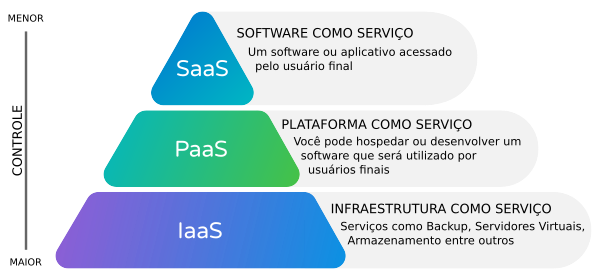

# Computação em Nuvem

A computação em nuvem, ou *cloud computing*, é um modelo de uso de recursos computacionais no qual armazenamento, processamento, redes, bancos de dados, plataformas e softwares são disponibilizados pela Internet como serviços. Em vez de comprar servidores físicos, instalar sistemas em uma infraestrutura local e manter equipes dedicadas para administrar todo esse ambiente, a organização passa a acessar recursos computacionais sob demanda, pagando de acordo com o uso ou conforme planos contratados [@google_cloud_computing; @ibm_cloud_computing].

De forma simplificada, a computação em nuvem permite que empresas, instituições e usuários utilizem recursos de TI como se estivessem alugando capacidade computacional de um provedor especializado. Esses recursos ficam hospedados em data centers distribuídos geograficamente e são acessados por meio da Internet. Assim, uma empresa pode criar uma aplicação, armazenar grandes volumes de dados, executar análises ou disponibilizar sistemas corporativos sem precisar adquirir e manter toda a infraestrutura física necessária.

A ideia central da nuvem não é apenas “usar computadores de outra pessoa”, mas mudar a forma como a computação é planejada, contratada, escalada e gerenciada. Em ambientes tradicionais, a organização precisa prever sua demanda futura e comprar infraestrutura suficiente para suportá-la. Na nuvem, os recursos podem ser aumentados ou reduzidos conforme a necessidade, o que torna o modelo mais flexível para negócios sujeitos a variações de demanda.

[![Comparação simplificada entre os diferentes modelos: centralizado, distribuído e nuvem. Fonte: [\@Counto2026]](fig/aula14/1.png)](https://aws.amazon.com/pt/blogs/aws-brasil/como-iniciar-a-sua-jornada-na-nuvem-aws/)

## Infraestrutura tradicional e infraestrutura em nuvem

Antes da popularização da computação em nuvem, era comum que as organizações mantivessem seus próprios servidores, equipamentos de rede, sistemas de armazenamento, salas climatizadas, políticas de backup e equipes técnicas internas. Esse modelo é chamado de infraestrutura local, infraestrutura própria ou *on-premise*.

Nesse modelo, a empresa possui maior controle direto sobre os equipamentos, mas também assume todos os custos e responsabilidades relacionados à aquisição, manutenção, atualização, segurança física, energia, refrigeração, substituição de equipamentos e disponibilidade dos serviços. Além disso, muitas vezes os recursos adquiridos ficam subutilizados. Por exemplo, uma empresa pode comprar servidores dimensionados para períodos de pico, mas utilizá-los pouco na maior parte do tempo.

A computação em nuvem altera essa lógica. O provedor de nuvem mantém grandes data centers com servidores, sistemas de armazenamento, redes de alta velocidade, mecanismos de segurança e plataformas de gerenciamento. A empresa cliente acessa esses recursos como serviço. Assim, o investimento inicial em infraestrutura tende a ser substituído por um modelo de pagamento recorrente ou por uso.

Essa mudança também altera a forma como os projetos de tecnologia são desenvolvidos. Em vez de esperar semanas ou meses pela compra e instalação de servidores, uma equipe pode criar uma máquina virtual, um banco de dados ou um ambiente de desenvolvimento em poucos minutos. Isso acelera testes, desenvolvimento de aplicações, experimentação e implantação de soluções digitais.

## Como a computação em nuvem funciona

A computação em nuvem funciona por meio da combinação de vários elementos tecnológicos: data centers, virtualização, redes, armazenamento distribuído, automação, monitoramento e sistemas de cobrança por uso.

Os data centers são instalações físicas que concentram servidores, equipamentos de rede, sistemas de energia, climatização e segurança. Os grandes provedores de nuvem, como Google Cloud, Amazon Web Services, Microsoft Azure e IBM Cloud, operam data centers em diferentes regiões do mundo. Essa distribuição geográfica permite maior disponibilidade, menor latência e possibilidade de atender exigências legais ou regulatórias sobre localização dos dados.

A virtualização é uma das bases da computação em nuvem. Por meio dela, um servidor físico pode ser dividido em várias máquinas virtuais, cada uma funcionando como se fosse um computador independente. Isso permite melhor aproveitamento dos recursos físicos e facilita a criação, remoção e redimensionamento de ambientes computacionais.

Além das máquinas virtuais, a nuvem também utiliza contêineres, orquestração, armazenamento de objetos, bancos de dados gerenciados, redes virtuais e serviços sem servidor (*serverless*). Esses componentes permitem que aplicações sejam construídas de forma mais flexível, escalável e automatizada.

De forma geral, o funcionamento da nuvem pode ser entendido em quatro etapas:

1.  O usuário ou a empresa acessa uma plataforma de nuvem pela Internet.
2.  A plataforma permite selecionar recursos, como servidores, armazenamento, bancos de dados ou aplicações.
3.  O provedor aloca esses recursos em sua infraestrutura física.
4.  O cliente utiliza os serviços contratados e paga conforme o modelo de cobrança definido.

## Características principais da computação em nuvem

A computação em nuvem possui algumas características que a diferenciam dos modelos tradicionais de infraestrutura.

### Serviço sob demanda

Os recursos podem ser provisionados quando necessário. Uma empresa pode criar uma máquina virtual, contratar armazenamento adicional ou disponibilizar um banco de dados sem precisar adquirir novos equipamentos físicos.

### Acesso amplo pela rede

Os serviços são acessados pela Internet ou por redes privadas. Isso permite que equipes distribuídas geograficamente utilizem os mesmos sistemas, dados e aplicações.

### Compartilhamento de recursos

Os provedores de nuvem utilizam infraestrutura compartilhada entre diferentes clientes. Embora os recursos físicos possam ser compartilhados, mecanismos de isolamento lógico garantem que os dados e aplicações de cada cliente permaneçam separados.

### Elasticidade

Elasticidade é a capacidade de aumentar ou reduzir recursos conforme a demanda. Por exemplo, um sistema de vendas pode precisar de mais capacidade durante datas promocionais e retornar a uma configuração menor após o pico de acesso.

### Pagamento pelo uso

Muitos serviços em nuvem seguem o modelo *pay-as-you-go*, isto é, pagamento conforme o uso. Isso significa que a organização paga pelos recursos efetivamente utilizados, como tempo de processamento, volume de armazenamento, transferência de dados ou quantidade de requisições.

## Modelos de serviço em nuvem

Os modelos de serviço indicam o nível de responsabilidade do provedor e do cliente. Os três modelos clássicos são IaaS, PaaS e SaaS [@google_cloud_computing; @ibm_cloud_computing].

.

### IaaS: Infraestrutura como Serviço

IaaS significa *Infrastructure as a Service*, ou Infraestrutura como Serviço. Nesse modelo, o provedor oferece recursos básicos de infraestrutura, como máquinas virtuais, armazenamento, redes, balanceadores de carga e firewalls.

O cliente não precisa comprar servidores físicos, mas ainda é responsável por instalar e administrar sistemas operacionais, bibliotecas, aplicações e configurações de segurança. É o modelo que oferece maior controle técnico entre os três principais modelos de serviço.

Exemplos de uso de IaaS incluem:

-   criação de servidores virtuais;
-   hospedagem de aplicações;
-   ambientes de teste e desenvolvimento;
-   armazenamento de arquivos;
-   recuperação de desastres;
-   substituição parcial de data centers locais.

Um exemplo prático seria uma empresa criar uma máquina virtual Linux na nuvem para hospedar uma API ou um sistema Web. O provedor mantém a infraestrutura física, mas a equipe técnica da empresa configura o sistema operacional, instala dependências e publica a aplicação.

### PaaS: Plataforma como Serviço

PaaS significa *Platform as a Service*, ou Plataforma como Serviço. Nesse modelo, o provedor oferece um ambiente pronto para desenvolvimento, execução e implantação de aplicações. O cliente não precisa administrar servidores, sistemas operacionais ou parte significativa da infraestrutura.

A equipe de desenvolvimento se concentra mais no código da aplicação e menos na configuração do ambiente. O provedor gerencia recursos como sistema operacional, servidor de aplicação, escalabilidade, atualizações e parte da segurança.

Exemplos de uso de PaaS incluem:

-   implantação de aplicações Web;
-   desenvolvimento de APIs;
-   ambientes de teste;
-   integração contínua;
-   hospedagem de aplicações em contêineres;
-   uso de bancos de dados gerenciados.

Um exemplo seria uma equipe publicar uma aplicação Node.js, Java, Python ou PHP em uma plataforma de nuvem sem precisar configurar manualmente o servidor. A plataforma cuida de parte da execução, escalabilidade e disponibilidade.

### SaaS: Software como Serviço

SaaS significa *Software as a Service*, ou Software como Serviço. Nesse modelo, o usuário acessa uma aplicação pronta pela Internet, geralmente por navegador ou aplicativo. O provedor gerencia toda a infraestrutura, a plataforma, a manutenção, as atualizações e a segurança do software.

Esse é o modelo mais próximo do usuário final. Exemplos comuns incluem sistemas de e-mail, editores de documentos online, plataformas de videoconferência, sistemas de CRM, ferramentas de armazenamento de arquivos e plataformas de colaboração.

Exemplos de SaaS incluem:

-   Google Workspace;
-   Microsoft 365;
-   Dropbox;
-   Salesforce;
-   Slack;
-   sistemas acadêmicos e administrativos acessados via navegador.

No SaaS, o usuário normalmente não se preocupa com servidores, banco de dados, sistema operacional ou atualizações. Ele apenas acessa e utiliza o software.

## Comparação entre IaaS, PaaS e SaaS

A diferença entre IaaS, PaaS e SaaS está principalmente no nível de controle e responsabilidade.

No IaaS, o cliente tem mais controle, mas também mais responsabilidades técnicas. No PaaS, o cliente se concentra no desenvolvimento da aplicação, enquanto o provedor administra a plataforma. No SaaS, o cliente utiliza o software pronto, sem gerenciar a infraestrutura.

| Modelo | O cliente gerencia | O provedor gerencia | Exemplo |
|------------------|------------------|------------------|------------------|
| IaaS | Sistema operacional, aplicações, dados e configurações | Servidores físicos, rede, armazenamento e virtualização | Máquina virtual na nuvem |
| PaaS | Código, dados e regras da aplicação | Infraestrutura, sistema operacional e ambiente de execução | Plataforma para publicar uma API |
| SaaS | Uso e configuração do software | Toda a aplicação e infraestrutura | E-mail corporativo online |

## Modelos de implantação

Além dos modelos de serviço, a computação em nuvem também pode ser classificada de acordo com o modelo de implantação: nuvem pública, privada, híbrida e multinuvem.

### Nuvem pública

Na nuvem pública, os recursos são oferecidos por um provedor externo e acessados pela Internet. A infraestrutura pertence ao provedor, mas é compartilhada entre vários clientes. Esse é o modelo mais comum quando se fala em computação em nuvem.

A nuvem pública é adequada para empresas que desejam escalabilidade, flexibilidade e redução de investimentos iniciais em infraestrutura. Também é útil para aplicações Web, armazenamento, análise de dados, backup, desenvolvimento de software e serviços digitais.

### Nuvem privada

Na nuvem privada, a infraestrutura é dedicada a uma única organização. Ela pode estar localizada no próprio data center da empresa ou ser hospedada por um provedor externo. A principal característica é o uso exclusivo por uma organização.

Esse modelo é comum em instituições que possuem requisitos rigorosos de segurança, privacidade, controle ou conformidade regulatória. No entanto, tende a exigir maior investimento e maior esforço de administração.

### Nuvem híbrida

A nuvem híbrida combina nuvem pública e nuvem privada. Nesse modelo, parte dos sistemas permanece em infraestrutura própria ou privada, enquanto outros serviços são executados em nuvem pública.

Esse modelo é útil quando uma organização precisa manter determinados dados ou sistemas sob maior controle, mas deseja aproveitar a escalabilidade e os serviços avançados da nuvem pública. Por exemplo, uma empresa pode manter dados sensíveis em ambiente privado e utilizar a nuvem pública para análise de dados ou aplicações de atendimento ao cliente.

### Multinuvem

A estratégia multinuvem, ou *multi-cloud*, consiste no uso de mais de um provedor de nuvem pública. Uma organização pode usar, por exemplo, serviços do Google Cloud, AWS, Microsoft Azure e IBM Cloud ao mesmo tempo.

Essa estratégia pode reduzir dependência de um único fornecedor, aumentar resiliência e permitir o uso dos melhores serviços de cada provedor. Porém, também aumenta a complexidade de gestão, integração, segurança, monitoramento e controle de custos.

## Infraestrutura da computação em nuvem

A infraestrutura de nuvem é composta por diversos elementos físicos e lógicos. Entre os principais, destacam-se servidores, armazenamento, redes, virtualização, regiões, zonas de disponibilidade e mecanismos de segurança.

### Servidores e processamento

Os servidores são responsáveis pelo processamento das aplicações. Na nuvem, esse processamento pode ser oferecido por máquinas virtuais, contêineres, funções serverless ou serviços especializados para inteligência artificial e análise de dados.

Para aplicações simples, uma máquina virtual pode ser suficiente. Para aplicações maiores, podem ser utilizados clusters de contêineres, balanceadores de carga e escalabilidade automática.

### Armazenamento

O armazenamento em nuvem permite guardar arquivos, bancos de dados, imagens, vídeos, backups e grandes volumes de dados. Existem diferentes tipos de armazenamento, como armazenamento de objetos, armazenamento em blocos e armazenamento de arquivos.

Também é comum classificar o armazenamento conforme a frequência de acesso:

-   armazenamento quente (*hot storage*): usado para dados acessados frequentemente;
-   armazenamento morno (*warm storage*): usado para dados acessados ocasionalmente;
-   armazenamento frio (*cold storage*): usado para arquivamento e dados raramente acessados.

Essa classificação influencia o custo. Dados acessados com frequência exigem disponibilidade rápida e tendem a ser mais caros. Dados arquivados podem ter custo menor, mas maior tempo de recuperação.

### Redes

As redes conectam usuários, aplicações, servidores, bancos de dados e serviços. Na nuvem, é possível configurar redes virtuais, sub-redes, endereços IP, regras de firewall, balanceadores de carga e conexões privadas.

O tráfego de rede também pode impactar custos, especialmente quando há transferência de grandes volumes de dados para fora da nuvem ou entre regiões diferentes.

### Regiões e zonas de disponibilidade

Os provedores de nuvem organizam sua infraestrutura em regiões geográficas e zonas de disponibilidade. Uma região corresponde a uma área geográfica, como um país ou continente. Uma zona de disponibilidade é um conjunto isolado de data centers dentro de uma região.

Essa organização permite criar aplicações mais resilientes. Se uma zona apresentar falha, outra zona pode continuar atendendo os usuários. Sistemas críticos costumam ser distribuídos entre múltiplas zonas ou regiões.

### Segurança

A segurança em nuvem envolve mecanismos técnicos e políticas de gestão. Entre os recursos comuns estão criptografia, controle de acesso, autenticação multifator, monitoramento, registros de auditoria, firewalls, redes privadas e ferramentas de detecção de ameaças.

Um ponto importante é o modelo de responsabilidade compartilhada. O provedor é responsável pela segurança da infraestrutura da nuvem, enquanto o cliente é responsável pela segurança do que configura e executa na nuvem. Por exemplo, o provedor protege os data centers e a infraestrutura física, mas o cliente precisa configurar corretamente permissões de usuários, senhas, chaves de acesso e regras de rede.

## Benefícios da computação em nuvem

A computação em nuvem oferece benefícios técnicos, econômicos e estratégicos.

### Redução de investimento inicial

Em vez de comprar servidores e montar um data center próprio, a organização pode contratar recursos sob demanda. Isso reduz a necessidade de investimento inicial em hardware e infraestrutura física.

### Escalabilidade

A nuvem permite aumentar ou diminuir recursos conforme a demanda. Essa característica é importante para sistemas com variações sazonais, como lojas virtuais, plataformas educacionais, sistemas de inscrição e aplicações acessadas por muitos usuários em determinados períodos.

### Agilidade

A criação rápida de ambientes favorece inovação e experimentação. Equipes podem testar soluções, criar protótipos e lançar aplicações com menor tempo de espera.

### Disponibilidade

Os provedores de nuvem oferecem recursos para redundância, backup e recuperação de desastres. Isso contribui para manter serviços disponíveis mesmo diante de falhas.

### Acesso a tecnologias avançadas

A nuvem facilita o acesso a serviços de inteligência artificial, aprendizado de máquina, análise de grandes volumes de dados, Internet das Coisas, bancos de dados escaláveis e ferramentas de automação.

### Foco no negócio

Ao transferir parte da gestão da infraestrutura para o provedor, a equipe interna pode se concentrar em atividades mais próximas dos objetivos da organização, como desenvolvimento de soluções, melhoria de processos e análise de dados.

## Custos e desafios

Apesar dos benefícios, a computação em nuvem não é uma solução automática para todos os problemas. A migração para a nuvem exige planejamento técnico, financeiro e organizacional.

### Controle de custos

O modelo de pagamento por uso pode ser vantajoso, mas também pode gerar gastos inesperados se não houver monitoramento. Máquinas virtuais esquecidas, armazenamento excessivo, tráfego de rede elevado e serviços mal configurados podem aumentar a fatura.

Entre os principais direcionadores de custo estão:

-   processamento;
-   armazenamento;
-   tráfego de rede;
-   serviços gerenciados;
-   licenciamento de software;
-   suporte técnico;
-   cópias de segurança;
-   uso de recursos em múltiplas regiões.

### Segurança e privacidade

Embora grandes provedores invistam fortemente em segurança, configurações incorretas feitas pelo cliente podem expor dados e sistemas. Por isso, é essencial aplicar boas práticas de controle de acesso, criptografia, monitoramento e auditoria.

### Dependência de fornecedor

Ao utilizar serviços específicos de um provedor, a organização pode se tornar dependente de suas tecnologias, preços e políticas. Esse fenômeno é conhecido como *vendor lock-in*. Estratégias como uso de padrões abertos, contêineres e arquitetura multinuvem podem reduzir essa dependência, mas também aumentam a complexidade.

### Complexidade de migração

Migrar sistemas existentes para a nuvem pode ser complexo. Sistemas antigos podem depender de configurações específicas, bancos de dados locais, integrações frágeis ou requisitos de desempenho difíceis de reproduzir. Por isso, nem toda aplicação deve ser migrada da mesma forma.

### Conformidade legal e regulatória

Organizações que lidam com dados sensíveis precisam considerar legislações e normas aplicáveis, como regras de proteção de dados, exigências de auditoria e restrições sobre localização geográfica das informações.

## Casos de uso

A computação em nuvem pode ser aplicada em diferentes contextos.

### Desenvolvimento de aplicações

Equipes de desenvolvimento podem usar a nuvem para criar, testar e publicar aplicações. Isso reduz a necessidade de configurar servidores locais e facilita a colaboração entre desenvolvedores.

### Backup e recuperação de desastres

Empresas podem armazenar cópias de segurança em nuvem e criar planos de recuperação em caso de falhas, ataques ou desastres físicos.

### Análise de dados

A nuvem permite processar grandes volumes de dados usando ferramentas de Big Data, bancos de dados analíticos e serviços de aprendizado de máquina.

### Educação

Instituições de ensino podem usar plataformas em nuvem para ambientes virtuais de aprendizagem, laboratórios remotos, armazenamento de materiais, videoconferências e sistemas acadêmicos.

### Sistemas corporativos

Empresas podem usar sistemas SaaS para gestão financeira, relacionamento com clientes, recursos humanos, comunicação, colaboração e controle de projetos.

## Computação em nuvem e inteligência artificial

A expansão da inteligência artificial aumentou a importância da computação em nuvem. Modelos de IA, especialmente modelos generativos, exigem grande capacidade de processamento, armazenamento e redes de alta velocidade.

Provedores de nuvem passaram a oferecer serviços especializados para treinamento, implantação e uso de modelos de aprendizado de máquina. Esses serviços incluem plataformas de IA, GPUs, TPUs, APIs de linguagem natural, visão computacional, tradução automática e geração de conteúdo.

A nuvem também permite que organizações menores acessem recursos que antes estavam disponíveis apenas para grandes empresas com infraestrutura própria. Entretanto, esses serviços podem ter custos elevados e exigem planejamento para uso eficiente.

## Computação de borda

A computação de borda, ou *edge computing*, aproxima o processamento dos locais onde os dados são gerados. Em vez de enviar todos os dados para um data center distante, parte do processamento ocorre em dispositivos, sensores, gateways ou servidores próximos ao usuário.

Esse modelo é importante para aplicações que exigem baixa latência, como veículos autônomos, Internet das Coisas, realidade aumentada, reconhecimento facial, monitoramento industrial e cidades inteligentes.

A computação de borda não substitui a nuvem, mas complementa sua arquitetura. Dados podem ser processados inicialmente na borda e enviados posteriormente para a nuvem para armazenamento, análise histórica ou treinamento de modelos.

## Considerações para adoção da nuvem

Antes de adotar a computação em nuvem, uma organização deve avaliar seus objetivos, orçamento, sistemas existentes, requisitos de segurança, competências técnicas e estratégia de longo prazo.

Algumas perguntas importantes são:

-   Quais sistemas devem ser migrados?
-   Quais dados podem ser armazenados na nuvem?
-   Quais requisitos legais precisam ser atendidos?
-   Qual modelo de serviço é mais adequado: IaaS, PaaS ou SaaS?
-   A organização precisa de nuvem pública, privada, híbrida ou multinuvem?
-   Como os custos serão monitorados?
-   Quem será responsável pela segurança e governança?
-   Existe risco de dependência excessiva de um fornecedor?
-   A equipe possui conhecimento técnico suficiente?

A decisão de usar nuvem deve estar alinhada à estratégia da organização. A nuvem pode reduzir custos, aumentar agilidade e ampliar capacidades tecnológicas, mas também pode gerar complexidade se for adotada sem planejamento.

## Síntese

A computação em nuvem representa uma transformação na forma como recursos computacionais são consumidos e gerenciados. Seu principal valor está na possibilidade de acessar infraestrutura, plataformas e softwares pela Internet, com escalabilidade, flexibilidade e pagamento conforme o uso.

Os modelos IaaS, PaaS e SaaS indicam diferentes níveis de controle e responsabilidade. Os modelos de implantação — pública, privada, híbrida e multinuvem — ajudam a definir como os recursos serão distribuídos e administrados.

Para organizações modernas, a nuvem é uma base importante para inovação, análise de dados, inteligência artificial, colaboração e transformação digital. No entanto, seu uso deve ser planejado com atenção a custos, segurança, governança, conformidade e adequação ao problema a ser resolvido.
